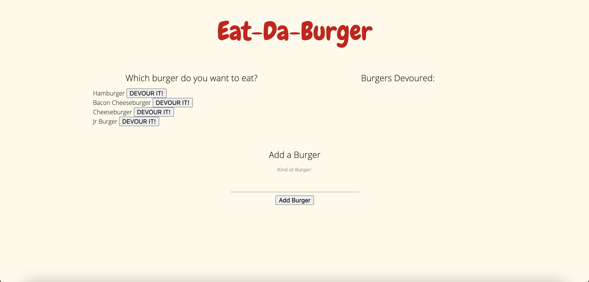

# Eat-Da-Burger

Full Stack application that utilizes Express, MySql, HTML, CSS, and Javascript. You can add burgers to the table and update their status to "Devoured." I ran into issues getting my button to connect that function, but you can add burgers.

## Table of Contents
* [Installation](#Installation)
* [Usage](#Usage)
* [License](#License)
* [Contributing](#Contributing)
* [Tests](#Tests)
* [Questions](#Questions)

## Installation
Run Command: npm i

## Usage
Open link and click on a burger to devour or add your own burger to the table

Heroku Link: https://tranquil-river-97452.herokuapp.com/ (I followed the given instructions and still cannot get JawsDB to load correctly. Hopefully I can get it fixed before it's graded)

## License
This project is licensed under the Unlicensed license.

## Contributing
No

## Tests
N/A

## Questions
If you have any questions, you can find me on Github under at http://github.com/kayleehorner. Still have questions? You can email me at: kayleeahorner@staples.com

## Screenshots

